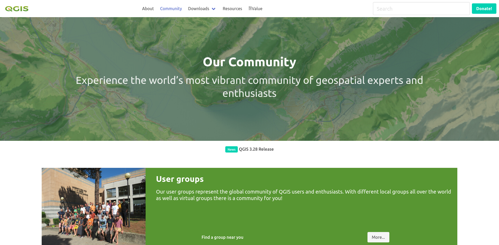

# QGIS Hugo Website



By Tim Sutton and QGIS Contributors.

## 🏃Before you start

This web site is a static site built using [Hugo](https://gohugo.io/).

 and using the [hugo bulma blocks theme](https://github.com/kartoza/hugo-bulma-blocks-theme).

## 🛒 Getting the Code

development
```
git clone https://github.com/qgis/QGIS-Hugo.git
cd QGIS-Hugo
```

Clone the repo:

```
git clone https://github.com/qgis/qgis-hugo.git
```

Run the site:

Press ```Ctl-Shift-D``` then choose the following runner:

'Run dev using locally installed Hugo'

the click the green triangle next to  the runner to start it.

Once the site is running, you can open it at:

<http://localhost:1313>

The site will automatically refresh any page you have open if you edit it and save your work. Magical eh?

## 💮 Changing the templates

| Page type       | Path                                     |
| --------------- | ---------------------------------------- |
| Landing Page    | themes/qgis/layouts/index.html           |
| Top Level Pages | themes/qgis/layouts/_default/single.html |

## 🏠 Editing the landing (home) page

The layout of the landing page is themes/hugo-bulma-blocks-theme/layouts/index.html: the main page has many diverse blocks, that are not used anywhere else, hence its content is mostly in the partials.

The ``content/_index.md`` contains the front matter of the page and the contents for the `feature` shortcodes. Just edit whatever you like there. The blocks shortcodes are described [here](https://github.com/qgis/QGIS-Hugo/blob/main/docs/shortcodes.md)


## 📃 Adding a top level page

### Create the content

Content pages are stored in the ``content`` folder. The top level documents there will be rendered with the top level page theming.

For example to add an about page, create ``content/about.md``

The page will be accessible then at /about/

### 🖼️ Referencing Images and Media

Place images and media in ```static/img```. Everything in ```static``` is referenced
from the top level of the site e.g.  ```static/img/foo.png``` would be referenced in
markdown as ```/img/foo.png```.

## 📦 Blocks Shortcodes

The site uses a number of shortcodes to create reusable blocks of content. These are defined in the ```themes/hugo-bulma-blocks-theme/layouts/shortcodes/``` folder.

The shortcodes with screenshots are described [here](https://github.com/qgis/QGIS-Hugo/blob/main/docs/shortcodes.md)

<!-- 3rd level header with icon with title Reusable header web component -->
### Reusable header web component

TODO

### Sidebar

Sidebar is implemented in themes/hugo-bulma-blocks-theme/layouts/partials/sidebar.html

Items are retrieved from config.toml under `[menu]` section. `weight` parameter defines the order of the item.

To enable sidebar on the content page, use the following template:

```
---
type: "page"
...
sidebar: true
---


... add content here ...


```
